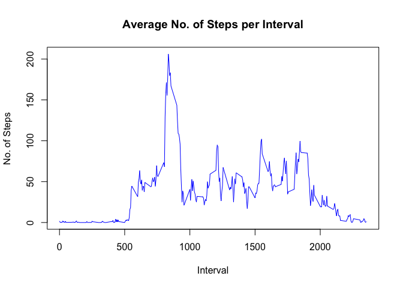

# Reproducable Research: Course Project 1
Mattias Östlund  
12 juni 2016  


## Preparation

Packages used in this document are:

*   downloader
*   tidyr
*   dplyr
*   lubridate
*   ggplot2


Download, unzip and load the data to d

```r
url <- "https://d396qusza40orc.cloudfront.net/repdata%2Fdata%2Factivity.zip"
download(url, dest="dataset.zip", mode="wb") 
unzip ("dataset.zip", exdir = "./")
d <- read.csv("activity.csv")
```

## What is mean total number of steps taken per day?
### Prepare dataset


```r
dd <- d %>% 
        filter(!is.na(steps)) %>%
        group_by(date) %>%
        summarise(no_of_steps = sum(steps))
```


### Result

Histogram

```r
hist(dd$no_of_steps, main = "Total Steps", xlab = "No of Steps", col = "blue")
```

<!-- -->

The average of no of steps per day is **10766** and meadian is **10765**


## Daily activity pattern
### Prepare dataset


```r
dd <- d %>% 
        filter(!is.na(steps)) %>%
        group_by(interval) %>%
        summarise(no_of_steps = mean(steps))

max_interval <- dd[which.max(dd$no_of_steps),]
average_steps <- as.integer(mean(d$steps, na.rm=TRUE))
```


### Result


```r
plot(dd$interval, dd$no_of_steps, type = "l", main = "Average No. of Steps per Interval", xlab = "Interval", ylab ="No. of Steps", col = "blue")
```

<!-- -->

The interval with max steps is **835** and has **206** steps.


## Imputing missing values


Total numbers of rows of missing data (NA) are **2304**.

Strategy to replace NA are taking the average steps for whole data set. Use the variable, average_steps which has the value of **37**.

### Replace NA's

Create a new dataset d_na whwew NA's are replaced with **37**.

```r
d_na <- d
d_na$steps[which(is.na(d_na$steps))] <- average_steps
```

Histogram with replace NA's

```r
dd_na <- d_na %>% 
        group_by(date) %>%
        summarise(no_of_steps = sum(steps))
hist(dd_na$no_of_steps, main = "Total Steps", xlab = "No of Steps", col = "blue")
```

<!-- -->

The average of no of steps per day is **10751** and meadian is **10656**

## Differences in activity patterns between weekdays and weekends


```r
dd_na <- d_na %>%
  mutate(wd = weekdays(ymd(as.character(date)),abbreviate = TRUE), wtype = factor(ifelse(wd %in% c("Mån", "Tis", "Ons", "Tor", "Fre"), "weekday" , "weekend"))) %>%
  group_by(wtype, interval) %>%
  summarise(no_of_steps = mean(steps))

g <- ggplot(data=dd_na, aes(x=interval, y=no_of_steps)) 
g <- g +  geom_line(color="blue")
g <- g + facet_wrap( ~ wtype, ncol = 1)
g <- g + ggtitle("Activity patterns between weekdays and weekends")
g <- g + xlab("Interval")
g <- g + ylab("No of Steps")
g
```

<!-- -->

### End of Report
